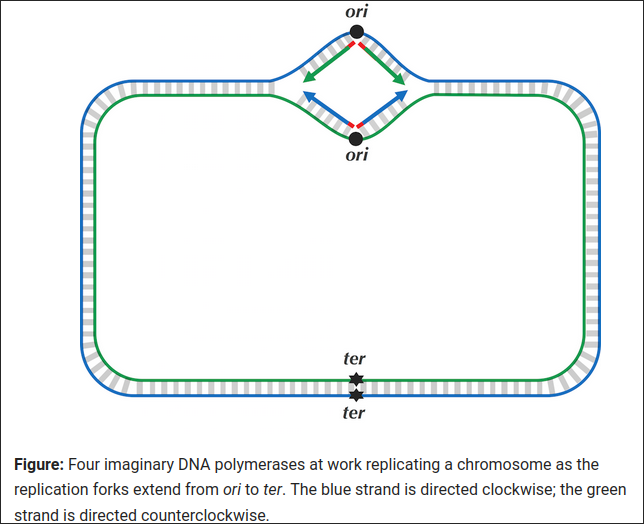
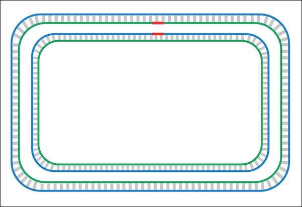
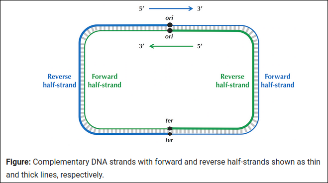
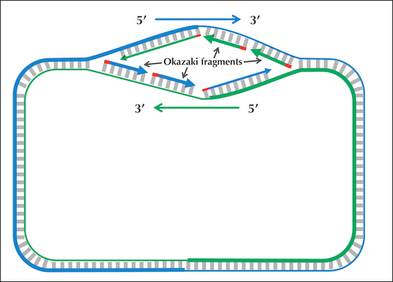
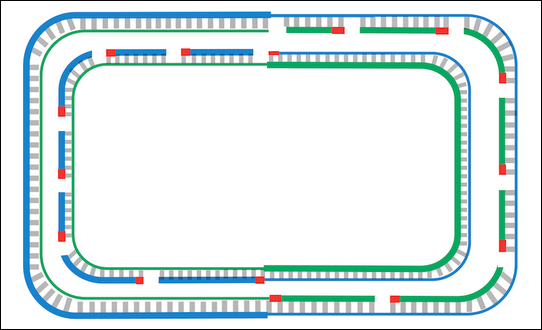
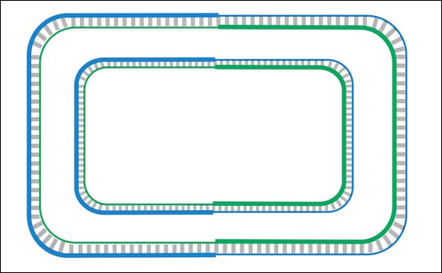
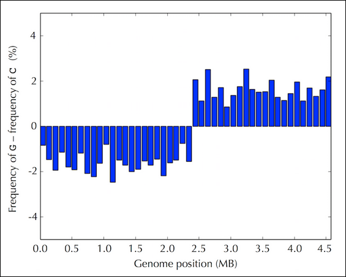
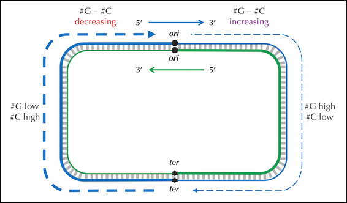
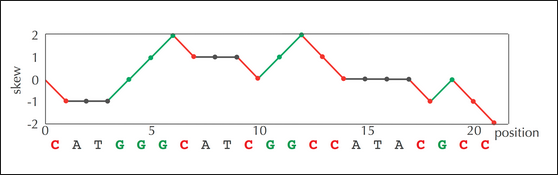
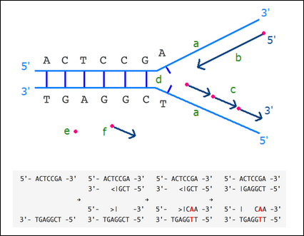

# 1.1 The Simplest Way to Replicate DNA

## What is DNA Replication?
DNA replication is the process by which a cell duplicates its DNA before division. It ensures that each daughter cell receives an exact copy of the genetic material.

## Steps of DNA Replication (Basic View)
1. Unwinding the DNA:
   - DNA helicase unzips the double helix at the origin of replication (ori) by breaking hydrogen bonds.
   - Two replication forks are formed, each with a leading and a lagging strand.
   - This creates a replication bubble with two replication forks moving in opposite directions until the strands completely separate at the replication terminus (ter).
  

2. Primer Placement:
   - DNA polymerase cannot start replication on its own (doesn't wait for the strands to fully separate); it needs a primer (a short RNA sequence, red in the above image).
   - Primase (an enzyme) places primers at the starting points on both strands.

3. DNA Polymerization:
   - 4 DNA polymerases extend the new DNA strands by adding nucleotides.
   - DNA polymerases extend beginning with the primer and proceeding from ori to ter in either clockwise or counterclockwise direction.
   - Both strands are replicated simultaneously but in different ways (as we'll see in asymmetry).

4. Completion:
   - All four DNA polymerases finish their respective strands and reach ter.
   - We have two pairs of complementary strands and the cell is ready to divide.
  


## Flaw in the Simplified Model
The simplest explanation wrongly assumes DNA polymerase can synthesize in both directions. Reality:
- DNA polymerase can only add nucleotides to the 3' end of a growing strand.
- This restriction leads to asymmetry, requiring different strategies for the two strands.


---

# 1.2 Asymmetry of Replication

## Why is DNA Replication Asymmetric?
- Asymmetric: Forward and reverse half strands have different fates wrt replication.
- DNA polymerase can move in reverse direction only (3' → 5').
- It can copy the reverse half strand (3' → 5') continuously, but the forward half strand (5' → 3') requires a different approach.
- DNA polymerase can not move in the forward direction (5' → 3') and here it replicates backward towards the ori.


## Leading vs. Lagging Strands
- Leading strand/Reverse half strand:
   - Template is 3' → 5', allowing continuous replication.
   - DNA polymerase moves toward the replication fork, adding nucleotides smoothly.

- Lagging strand/Forward half strand:
   - Template is 5' → 3', meaning DNA polymerase can't follow the fork directly.
   - Instead, it waits for the replication fork to open (around 2,000 nucleotides at a time).
   - Primase adds primers at intervals, and DNA polymerase synthesizes short fragments backward, known as Okazaki fragments.
   - DNA ligase later joins these fragments into a continuous strand.

   


## Replication Fork Dynamics
- The leading strand needs only one primer at the beginning.
- The lagging strand requires multiple primers due to its discontinuous nature.
- The result: Asymmetrical replication but equal completion of both strands.

## Joining Okazaki Fragments
- After the lagging strand is synthesized in fragments, DNA ligase seals the gaps between Okazaki fragments resulting in two daughter chromosomes (each having one parent strand and a newly synthesized daughter strand).
 

- This process ensures that the lagging strand becomes a continuous DNA strand, similar to the leading strand.


## Analogy: Car Factory Assembly Line
Think of DNA replication like an assembly line producing cars (DNA strands):
- The leading strand is like a conveyor belt moving smoothly without stopping (continuous).
- The lagging strand is like a worker who builds cars in sections, waiting for new parts to arrive (discontinuous).
- The Okazaki fragments are like different car parts assembled separately, then joined later.

Watch: https://youtu.be/TNKWgcFPHqw
---

# 1.3 Peculiar Statistics of the Forward and Reverse Half-Strands

## Observation of Cytosine and Guanine Frequencies:

- The E. coli genome was partitioned into 46 fragments of about 100,000 nucleotides each, covering the reverse and forward half-strands. (experimentally verified ter position)
- The reverse half-strand (first 23 fragments starting from ter) typically shows higher cytosine frequency (>25%) and lower guanine frequency (<25%).
- The forward half-strand (last 23 fragments starting at ori) typically shows lower cytosine frequency (<25%) and higher guanine frequency (>25%).

## Frequency Difference:

- A noticeable difference between guanine and cytosine frequencies in each fragment was observed across both strands.

- This pattern is not random (checked with an arbitrary position in the genome, still <25% cytosine and >25% guanine) but consistent, suggesting a possible method to identify the origin of replication.

## Potential Cause of the Pattern:

- The pattern could be linked to DNA replication asymmetry, where the reverse half-strand is double-stranded most of the time, while the forward half-strand spends more time single-stranded.
- Single-stranded DNA is more prone to mutation, and cytosine undergoes deamination (mutation to thymine) at a higher rate in single-stranded regions.

## Mutations in the Forward and Reverse Half-Strands:

- Deamination leads to a decrease in cytosine on the forward strand and guanine on the reverse strand.

- The differences in nucleotide counts suggest a method for identifying the replication origin (ori) by looking at the balance of guanine and cytosine.

## Skew Diagram:
- A skew diagram can be constructed by calculating the cumulative difference between guanine and cytosine as the genome is traversed.
- If nucleotides are counted as follows:
  - +1 for guanine
  - -1 for cytosine
  - 0 for adenine and thymine

- The skew diagram shows a transition point where the cumulative difference changes from negative (indicating the reverse half-strand) to positive (indicating the forward half-strand).

Skew diagram for DNA string CATGGGCATCGGCCATACGCC.


## Algorithm Idea for Identifying ori:
- By tracking the cumulative difference between guanine and cytosine as the genome is traversed, one can potentially identify the replication origin where this difference transitions from negative (reverse half-strand) to positive (forward half-strand).

## Minimum Skew Problem:
- The minimum skew problem involves finding the position in the genome where the cumulative difference between guanine and cytosine is minimized, indicating a potential origin of replication.
- Minimum Skew Problem: Find a position in a genome where the skew diagram attains a minimum.
   - Input: A DNA string Genome.
   - Output: All integer(s) i minimizing Skewi (Genome) among all values of i (from 0 to |Genome|).


## Practical Implication:

- The frequency of these nucleotides can be used as a statistical signature to locate ori in genomes where its position is unknown.

---
# 1.4 Some Hidden Messages are More Elusive than Others

## DnaA Boxes and the Frequent Words Problem
- E. coli ori and DnaA boxes: The minimum skew problem estimates the ori (origin of replication) at position 3923620 in E. coli. However, solving the Frequent Words Problem reveals no DnaA boxes at this location, indicating further analysis is needed.

- Vibrio cholerae ori: The ori of Vibrio cholerae provides insights into the algorithm, as it contains slight variations of the DnaA box sequence. These variations are biologically meaningful, showing that DnaA can bind to both perfect and slightly varied DnaA boxes.

## Hamming Distance and Approximate Pattern Matching
- The Hamming distance measures mismatches between two strings. It calculates how many positions two strings differ. Example: GGAAC and GGACC have a Hamming distance of 1.
- Hamming Distance Problem: Compute the Hamming distance between two strings.
   - Input: Two strings of equal length.
   - Output: The Hamming distance between these strings.

- Approximate Pattern Matching: A k-mer can appear in a string with at most *d* mismatches, and this is defined by the Hamming distance between the k-mer and its substring in the text. The task is to find all occurrences of a pattern with at most *d* mismatches.
- Approximate Pattern Matching Problem: Find all approximate occurrences of a pattern in a string.
   - Input: Strings Pattern and Text along with an integer d.
   - Output: All starting positions where Pattern appears as a substring of Text with at most d mismatches.


## Countd Function and Algorithms
- Countd Function: The Countd function calculates how many times a pattern appears in a string with at most *d* mismatches. For example, Count1("AACAAGCT", "AAAA") returns 4.

- ApproximatePatternCount Algorithm:
   - Input: Strings Pattern and Text as well as an integer d.
   - Output: Countd(Text, Pattern).

   ```
   ApproximatePatternCount(Text, Pattern, d)
         count ← 0
         for i ← 0 to |Text| − |Pattern|
            Pattern′ ← Text(i , |Pattern|)
            if HammingDistance(Pattern, Pattern′) ≤ d
                  count ← count + 1
         return count
   ```

## Frequent Words with Mismatches
- Frequent Words with Mismatches: The problem is to find the most frequent k-mers in a string that may have up to *d* mismatches. 
- Frequent Words with Mismatches Problem: Find the most frequent k-mers with mismatches in a string.

   - Input: A string Text as well as integers k and d.
   - Output: All most frequent k-mers with up to d mismatches in Text.

- Efficient Approach Using Neighborhoods: Instead of checking all possible k-mers, the algorithm uses a frequency table and counts k-mers that are in the "neighborhood" of the current k-mer, i.e., those with Hamming distance ≤ *d*.

```
FrequentWordsWithMismatches(Text, k, d)
    Patterns ← an array of strings of length 0
    freqMap ← empty map
    n ← |Text|
    for i ← 0 to n - k
        Pattern ← Text(i, k)
        neighborhood ← Neighbors(Pattern, d)
        for j ← 0 to |neighborhood| - 1
            neighbor ← neighborhood[j]
            if freqMap[neighbor] doesn't exist
                freqMap[neighbor] ← 1
            else
                freqMap[neighbor] ← freqMap[neighbor] + 1
    m ← MaxMap(freqMap)
    for every key Pattern in freqMap
        if freqMap[Pattern] = m
            append Pattern to Patterns
    return Patterns
```

- Frequent Words with Mismatches and Reverse Complements Problem: Find the most frequent k-mers (with mismatches and reverse complements) in a string.

   - Input: A DNA string Text as well as integers k and d.
   - Output: All k-mers Pattern maximizing the sum Countd(Text, Pattern)+ Countd(Text, Patternrc) over all possible k-mers.

---
# 1.5 A Final Attempt at Finding DnaA Boxes in E. coli

## Final Attempt to Find DnaA Boxes in E. coli:
   - The goal is to find the most frequent 9-mers with 1 mismatch and reverse complements in a region suggested by the minimum skew.
   - The minimum skew is at position 3923620, but it's not assumed to be the exact origin of replication (ori) due to potential fluctuations.
   - A window of length 500 starting from 3923620 is chosen for analysis, aiming to capture the DnaA boxes.
   - Expanding the window may bring in: other clumped 9-mers that do not represent the DnaA box but appear in this window more often than the true DnaA box.

## Experimentally Confirmed DnaA Box Found:
   - The DnaA box (TTATCCACA) with 1 mismatch and its reverse complement (TGTGGATAA) are found as the most frequent 9-mers within the 500-nucletiode window.
   - The ori is confirmed to be 37 nucleotides after position 3923620, where the skew minimum occurs.

## Other Frequent 9-mers Detected:
   - Other frequent 9-mers (GGATCCTGG, GATCCCAGC, etc.) also appear with 1 mismatch and reverse complements.
   - Their function in the genome is unclear.
   - This reflects that genomes have hidden messages (e.g., regulatory motifs) unrelated to replication.
   - The existing computational approaches for finding ori are not perfect but are useful for generating candidate DnaA boxes.

## Comparative Genomics:
   - The next step suggests improving ori predictions using comparative genomics, which leverages evolutionary similarities to enhance predictions.

---
# 1.6 Epilogue: Complications in Ori Predictions

## Three Hypothesized 9-mers for ori:
- **Vibrio cholerae**: ATGATCAAG
- **Thermotoga petrophila**: CCTACCACC
- **E. coli**: TTATCCACA

## Challenges in Finding ori
- Some bacteria have fewer DnaA boxes than E. coli, making identification harder.
- The ter region may not be directly opposite ori, complicating the prediction.
- The skew minimum position is a rough indicator, and expanding the window may introduce irrelevant repeated substrings.

## Skew Diagram Complexity
- Skew diagrams, like that of Thermotoga petrophila, may not be as straightforward as E. coli's.
- The ori prediction for Thermotoga petrophila may be incorrect due to the complexity of its skew diagram.

## Practical Considerations
- The process of locating ori and DnaA boxes computationally involves challenges such as unreliable skew diagrams and potential errors in predictions.

## Final Challenge
- The task is to find a DnaA box in the *Salmonella enterica* genome as a practical exercise.

---
# 1.7 CS: Generating the Neighborhood of a String

## Goal: Generate d-neighborhood of a string
   - We aim to generate the d-neighborhood `Neighbors(Pattern, d)` — all k-mers whose Hamming distance from `Pattern` does not exceed `d`.

## Generating Immediate Neighbors (1-neighborhood)
```
ImmediateNeighbors(Pattern)
   Neighborhood ← the set consisting of single string Pattern
   for i = 1 to |Pattern|
      symbol ← i-th nucleotide of Pattern
      for each nucleotide x different from symbol
            Neighbor ← Pattern with the i-th nucleotide substituted by x
            add Neighbor to Neighborhood
   return Neighborhood
```

## Expanding to d-neighborhood (General Case)
   - Remove the first symbol of `Pattern` (denoted as `FirstSymbol(Pattern)`) to form a (k−1)-mer, `Suffix(Pattern)`.
   - **How Neighbors(Suffix(Pattern), d) helps**:
     - If `HammingDistance(Pattern′, Suffix(Pattern)) = d`, add `FirstSymbol(Pattern)` to the beginning of `Pattern′` to get a k-mer in `Neighbors(Pattern, d)`.
     - If `HammingDistance(Pattern′, Suffix(Pattern)) < d`, prepend any nucleotide to the beginning of `Pattern′`.
   - `Neighbors(CAA, 1)`
      - Start by generating `Neighbors(AA, 1) = {AA, CA, GA, TA, AC, AG, AT}`.
      - Prepend `C` to each of these patterns to get `CAA, CCA, CGA, CTA, CAC, CAG, CAT`.
      - Prepend any nucleotide to `AA` to get `AAA, CAA, GAA, TAA`.
      - Resulting `Neighbors(CAA, 1)` = `{CAA, CCA, CGA, CTA, CAC, CAG, CAT, AAA, GAA, TAA}`.

## General Algorithm for d-neighborhood
-  Implement Neighbors to find the d-neighborhood of a string.
   - Input: A string Pattern and an integer d.
   - Output: The collection of strings Neighbors(Pattern, d). (You may return the strings in any order, but each line should contain only one string.)

```
Neighbors(Pattern, d)
   if d = 0
      return {Pattern}
   if |Pattern| = 1 
      return {A, C, G, T}
   Neighborhood ← an empty set
   SuffixNeighbors ← Neighbors(Suffix(Pattern), d)
   for each string Text from SuffixNeighbors
      if HammingDistance(Suffix(Pattern), Text) < d
            for each nucleotide x
               add x • Text to Neighborhood
      else
            add FirstSymbol(Pattern) • Text to Neighborhood
   return Neighborhood
```

## Complexity Consideration
   - Running Time: The algorithm generates all k-mers of Hamming distance at most `d` from `Pattern`.
   - Modify to Generate Exactly d Distance:
   - Adjust pseudocode to generate exactly d-neighbors by ensuring only patterns with exactly `d` mismatches are returned.
```
Neighbors(Pattern, d)
   if d = 0
      return {Pattern}
   if |Pattern| = 1 
      return {A, C, G, T}
   Neighborhood ← an empty set
   SuffixNeighbors ← Neighbors(Suffix(Pattern), d)
   for each string Text from SuffixNeighbors
      if HammingDistance(Suffix(Pattern), Text) < d
            for each nucleotide x
               add x • Text to Neighborhood
      else
            add FirstSymbol(Pattern) • Text to Neighborhood
   return Neighborhood
```

## Iterative Approach
```
IterativeNeighbors(Pattern, d)
   Neighborhood ← set consisting of single string Pattern
   for j = 1 to d
      for each string Pattern’ in Neighborhood
            add ImmediateNeighbors(Pattern') to Neighborhood
            remove duplicates from Neighborhood
   return Neighborhood
```

---
# 1.8 Week 2 FAQs
## Why is DNA polymerase unidirectional?
Watch: https://youtu.be/y4hKibS2fAo

## Why don’t we make the scoring function more robust in the Frequent Words with Mismatches Problem?
- The scoring function may count the same k-mers twice if they contribute to both `Countd(Text, Pattern)` and `Countd(Text, ReverseComplement(Pattern))`.
- For example, similar k-mers like CTTCAG and its reverse complement may lead to double counting.
- As a simplification, the function ignores reverse palindromes and nearly reverse palindromes, though these should be carefully considered for DnaA box candidates.

## How does deamination lead to a mutation?
- Forward half-strand is being synthesized as a single piece whereas the reverse half-strand is being synthesized in Okazaki fragments.

- Deamination occurs more on the bottom strand (Okazaki fragments) as it spends more time as a single-stranded.
- This process causes one daughter strand to contain a mutation after replication.


## Why are the values of the skew diagram at the beginning and end of the genome not the same?
- At the genome’s start, skew is zero.
- At the end, it is the difference between G's and C's in the genome, which will not be zero unless G and C amounts are equal, which is uncommon.

## Why don't we examine the difference between T and C or A and C? Why is G and C special in skew diagrams?
- Although alternatives are reasonable, the G-C difference is most useful in practice for constructing skew diagrams.
- T’s frequency on the forward strand does not change much as deamination might be reduced by subsequent mutations. Other factors contribute to GC skew, and it is useful in identifying ori in some species.


## Why is there any cytosine left in the forward strand after deamination?
- Only a small fraction of cytosine can mutate while maintaining the bacterium’s viability.

## Why do we analyze only one strand of DNA to compute the skew diagram?
- The skew is computed from the 5’ → 3’ direction of one strand.
- The skew diagram for the complementary strand will be the reverse due to opposite traversal directions, but both will point to the same ori position.

## What is the ratio of G/C and A/T base pairs within a single strand?
- In a double-stranded genome, G and C are equal, but within a single strand, they may differ.
- The GC-content refers to the percentage of G and C nucleotides in a genome and varies across species (e.g., Streptomyces coelicolor has 72%, Plasmodium falciparum has 20%, and humans have 42%).

## How do we select the number of mismatches (d) in the Frequent Words with Mismatches Problem?
- The parameter d is chosen based on intuition.
- It shouldn't be too small (missing true frequent words) or too large (spurious matches).
- Studies show that canonical DnaA boxes typically have one or two mutations.

## Why do we only consider mismatches in DnaA boxes and not insertions and deletions?
- Insertions and deletions would disrupt the DnaA binding, which relies on precise sequence intervals.

## Why do we analyze the window starting at the position where the skew achieves the minimum?
- This choice is arbitrary but works well in practice. Biologists should explore windows around the minimum skew.
